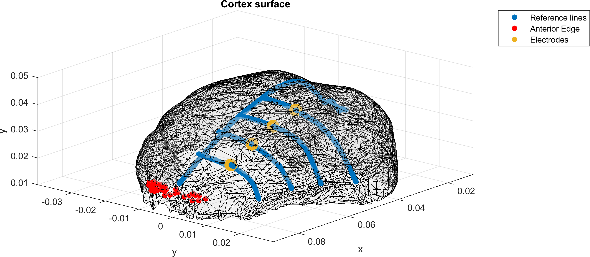
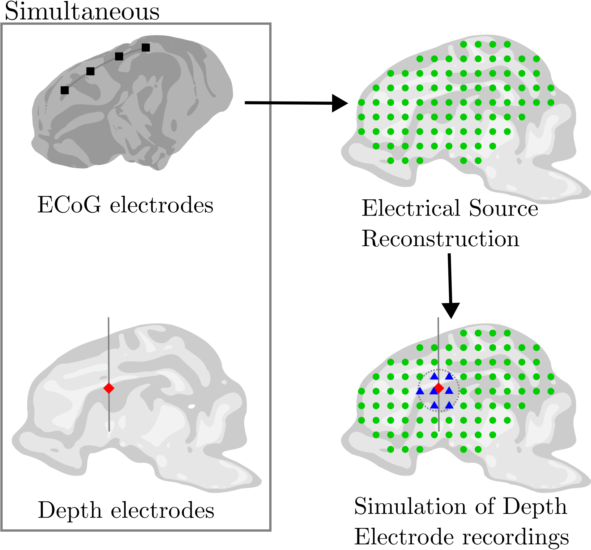

# Script 1: Automatic electrode location

Electrode positions in some animal models -such as minipig, _Sus scrofa_- are not yet fully standardized. Thus, the electrode positions must be determined manually.

- **Input:**
  - Surface of the brain cortex.
  - Protocol for placing electrodes.

- **Output:**
  - Electrode locations

The brain cortex surface was extracted from a publicly available MRI template, published by Norris et al. 
Extraction was performed using the CAT toolbox, running within the Brainstorm toolbox.
The resulting data was exported as 'cortex.mat'.

The protocol for placing the electrodes is as follows:
1. Identify Central Line.
2. Identify Anterior Edge.
3. Create a line parallel to the Central Line, separated by 10 mm from it.
4. Starting at 10 mm from the Anterior Edge, place ECoG electrodes with 10 mm center-to-center.
5. Identify the point between electrodes 2 and 3 as the Entry Point for stylet.
6. Use superior-inferior as the direction of the stylet.
7. Starting at 10 mm from the entry point, place Deep Electrodes with 5 mm center-to-center.

I want to rewrite this script as a Brainstorm-readable function in future versions.

## References
MRI brain templates of the male Yucatan minipig (2021) Norris C, Lisinski J, McNeil E, et al. NeuroImage. DOI: 10.1016/j.neuroimage.2021.118015

# Script 2: Estimate Deep Electrode Recordings via Electrical Source Imaging

Once the Wiener Kernel or Full Inverse Solution is computed, such data is used to simulate the recordings that could be obtained from Deep Electrodes.
For each intended depth electrode, a scout is created with the dipoles located within some given distance. These dipoles are averaged over each canonical direction, and then the magnitude is extracted.

This script was intended for a paper in which the data from these Estimated Deep Electrodes was compared to that of real Deep Electrodes.

## Prerrequisites

Brainstorm toolbox.

Copy to .brainstorm/process.

## Usage

After doing the inverse model (cite from Brainstorm page), select to Process -> Souces -> .
