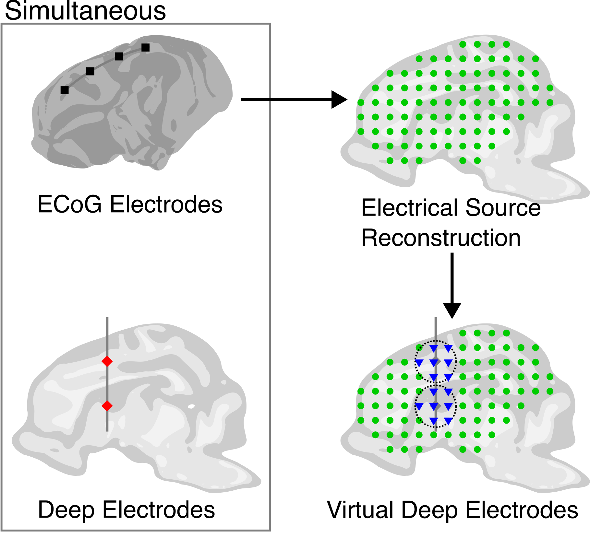
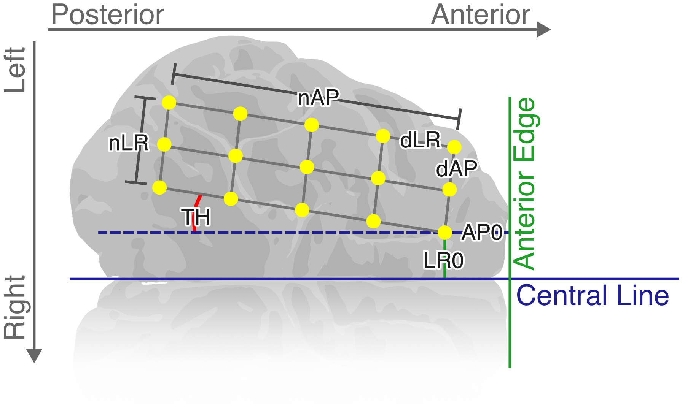
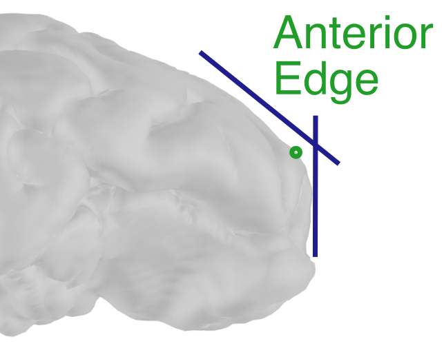
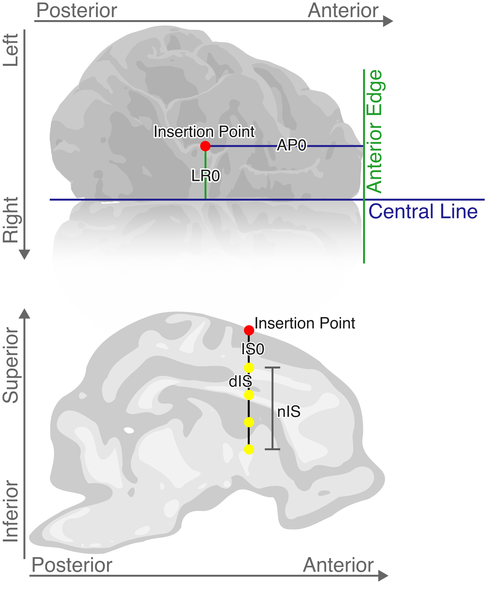

This repository contains a collection of custom scripts made by me during some projects in which I worked. They are written so that they can be integrated into the Brainstorm toolbox, which increases their usability by non-programmers.

Brainstorm is a toolbox written in Matlab for analysis of brain recordings including, but not limited to MEG, EEG, fNIRS, ECoG, etc. In the context of Electrical Source Imaging, Brainstorm offers integrations with state-of-the-art toolboxes such as CAT12 for processing anatomical MRI data, and OPENMEEG for solving the forward problems of EEG vs electrical dipoles.

# Setup

In order to run these scripts, make sure to have a working installation of [Brainstorm](https://neuroimage.usc.edu/brainstorm/Installation). 

Take note of the location of the folder `~/.brainstorm/process`; this is for user-defined processes. Copy the provided file `process_(...).m` to that folder, then run Brainstorm as usual. 

Information on usage is specific to each function.

# Script 2: Virtual Electrodes via Electrical Source Imaging

Once the inverse solution for the Electrical Source Imaging is computed, the resulting data is used to simulate recordings that would be obtained by theoretical deep electrodes located at arbitrary locations inside the brain. 

For each of these _virtual deep electrodes_, a volume scout is created by considering a sphere with its center at the proposed location and a radius of _R_ mm. 
The magnitudes of dipoles inside each scout are averaged over space in each canonical direction, thus obtaining a time series representing the _recordings_ from that virtual electrode. 

Although it is preferred to compute the magnitude of the averaged dipoles, there is also the option to compute the first PCA component of the data to obtain unsigned data. This is computationally expensive, and I haven't added the proper warnings yet. The temporary solution is to process by batches, yet the numerical stability of this hasn't been explored.

**This script is part of a paper under review.**

## Usage

1. Perform Electrical Source Reconstruction. For a tutorial on how to do that, follow [this link](https://neuroimage.usc.edu/brainstorm/Tutorials/SourceEstimation).
2. After computing electrical sources, drag the results to the _Process_ section and click `Run`.
3. Navigate to _Add process / Sources / Virtual Deep Electrodes_.
4. Adjust parameters and proceed.

# Script 1: Automatic electrode location

This script determines the locations of either a rectangular grid of surface electrodes, or depth electrodes on a stylet. The protocol for this is to locate the Central Line and Anterior Edge, then locate electrodes based on that information, taking into account the curvature of the surface.

## For surface electrodes

**Input:**
-  `surface` Surface triangulation, `struct`.
-  `nPA`  Size of rectangle grid in the Posterior-Anterior.
-  `nLR`  Size of rectangle grid in the Left-Right direction.
-  `PA0`  Distance [mm] from the Anterior Edge to the first electrode.
-  `LR0`  Distance [mm] from the Central Line to the first electrode.
-  `dPA`  Center-to-center distance between electrodes in the Posterior-Anterior direction.
-  `dLR`  Center-to-center distance between electrodes in the Left-Rigt direction.
-  `TH` Angle with respect to a parallel to the Central Line.

**Output:**
- `ElecLocs` Locations of electrodes, (nAP)x(nLR)x3

 

## For inserted electrodes

**Input:**
-  `surface` Surface triangulation, `struct`.
-  `nIS`  Number of electrodes in the stylet.
-  `PA0`  Distance [mm] from the Anterior Edge to the Insertion Point.
-  `LR0`  Distance [mm] from the Central Line to the Insertion Point.
-  `IS0`  Distance [mm] from the Insertion Point to the first electrode.
-  `dIS`  Center-to-center distance between electrodes in the stylet.

**Output:**
- `ElecLocs` Locations of electrodes, (1)x(nIS)x3

 

## NOTES

This function was developed for a project involving animal models for ischemic stroke. Electrode positions in some animal models --such as minipig, _Sus scrofa_-- are not yet fully standardized. Thus, the electrode positions must be determined manually following some protocol.

Multiple configurations were used for training purposes. I found it easier to code the placing protocol and **then** adjust based on observations, than to determine the locations based purely on observations.

The rewriting of this function as a Brainstorm process is not finished yet.

 

The algrithm is quite simple: the curved lines are constructed by taking strips of the cortex surface and then using local interpolation. Distance within the curve is computed via a cumulative length function.

